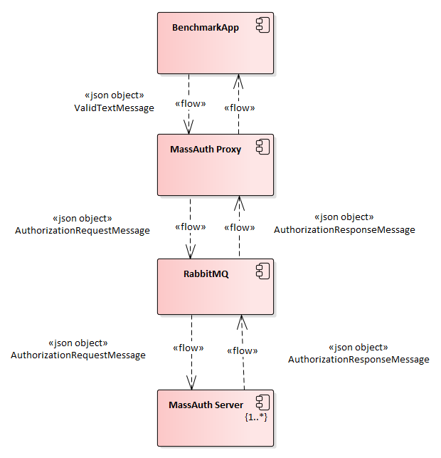

Stone Assemblies MassAuth Benckmarks
====================================

This repo includes some benchmarks of *[Stone Assemblies MassAuth](https://github.com/stoneassemblies/StoneAssemblies.MassAuth)*.

# Design

For these benchmarks we generated a lot messages and rules types with very simple implementations. The rules and messages are available in StoneAssemblies.MassAuth.Benchmarks. Rules and StoneAssemblies.MassAuth.Benchmarks.Messages NuGet packages.

The goal of theses benchmarks is test the evaluation speed, scalabilty and stability of the solution.

The following diagram shows the components and their interactions.



# Hosting 

The components used in this are the official docker images of Stone Assemblies MassAuth and rules are downloaded directly from the NuGet gallery.   

The software prerequisites to execute these benchmarks.

1) Docker
2) Tye

These benchmarks were written using [BenchmarkDotNet](https://github.com/dotnet/BenchmarkDotNet)

# Benchmarks

All benchmarks results were obtained on the following hardware.   

```

BenchmarkDotNet=v0.13.5, OS=Windows 11 (10.0.22621.1778/22H2/2022Update/SunValley2)
11th Gen Intel Core i7-11800H 2.30GHz, 1 CPU, 16 logical and 8 physical cores
.NET SDK=6.0.408
  [Host]     : .NET 6.0.16 (6.0.1623.17311), X64 RyuJIT AVX2
  DefaultJob : .NET 6.0.16 (6.0.1623.17311), X64 RyuJIT AVX2

```

## Single Message

For this benchmark, we run 3 instances of the authorization engine with some rules per message type. A single one message is sent and all rules are evaluate. 

| Rules Count |         Mean |         Error |        StdDev |
| ----------- | ------------:| -------------:| -------------:|
| **1**       | **7.943 ms** | **0.1569 ms** | **0.3444 ms** |
| **5**       | **7.760 ms** | **0.1274 ms** | **0.1129 ms** |
| **10**      | **7.170 ms** | **0.1429 ms** | **0.3311 ms** |
| **20**      | **7.022 ms** | **0.1324 ms** | **0.1472 ms** |
| **50**      | **7.102 ms** | **0.1374 ms** | **0.1687 ms** |
| **100**     | **7.127 ms** | **0.1353 ms** | **0.1329 ms** |


## Multiple Messages

For this benchmark, we run 3 instances of the authorization engine with some rules per message type. Multiple messages (up to 5) can be sent simultaneously and all rules are evaluated. 

| Parallel Requests | Rules Count |          Mean |         Error |        StdDev |
| ----------------- | ----------- | -------------:| -------------:| -------------:|
| **1**             | **1**       |  **7.150 ms** | **0.1263 ms** | **0.1771 ms** |
| **1**             | **5**       |  **6.999 ms** | **0.1209 ms** | **0.1010 ms** |
| **1**             | **10**      |  **7.015 ms** | **0.1079 ms** | **0.0957 ms** |
| **1**             | **20**      |  **6.967 ms** | **0.1315 ms** | **0.1230 ms** |
| **1**             | **50**      |  **7.046 ms** | **0.1368 ms** | **0.1280 ms** |
| **1**             | **100**     |  **7.097 ms** | **0.1408 ms** | **0.1317 ms** |
| **3**             | **1**       | **18.885 ms** | **0.3766 ms** | **0.5280 ms** |
| **3**             | **5**       | **19.360 ms** | **0.3739 ms** | **0.5710 ms** |
| **3**             | **10**      | **19.616 ms** | **0.3812 ms** | **0.5821 ms** |
| **3**             | **20**      | **18.826 ms** | **0.3749 ms** | **0.4318 ms** |
| **3**             | **50**      | **19.171 ms** | **0.3751 ms** | **0.4743 ms** |
| **3**             | **100**     | **18.718 ms** | **0.3674 ms** | **0.3773 ms** |
| **5**             | **1**       | **30.110 ms** | **0.5561 ms** | **0.4930 ms** |
| **5**             | **5**       | **30.027 ms** | **0.5904 ms** | **0.8654 ms** |
| **5**             | **10**      | **30.255 ms** | **0.6012 ms** | **0.5905 ms** |
| **5**             | **20**      | **29.736 ms** | **0.5564 ms** | **0.4933 ms** |
| **5**             | **50**      | **30.103 ms** | **0.5602 ms** | **0.5240 ms** |
| **5**             | **100**     | **30.301 ms** | **0.5995 ms** | **0.9509 ms** |


## Scalability and stability

For this benckmark, we run 5 instances of the authorization engine with some rules per message type. Multiple messages (up to 10) can be sent simultaneously and all rules are evaluated.

| Parallel Requests | Rules Count |          Mean |         Error |        StdDev |
| ----------------- | ----------- | -------------:| -------------:| -------------:|
| **1**             | **1**       |  **7.208 ms** | **0.1306 ms** | **0.1158 ms** |
| **1**             | **5**       |  **7.233 ms** | **0.1422 ms** | **0.2564 ms** |
| **1**             | **10**      |  **7.546 ms** | **0.1563 ms** | **0.4485 ms** |
| **1**             | **20**      |  **7.841 ms** | **0.2405 ms** | **0.7016 ms** |
| **1**             | **50**      |  **7.481 ms** | **0.1654 ms** | **0.4692 ms** |
| **1**             | **100**     |  **7.590 ms** | **0.1842 ms** | **0.5256 ms** |
| **3**             | **1**       | **19.131 ms** | **0.3795 ms** | **0.9092 ms** |
| **3**             | **5**       | **19.590 ms** | **0.3913 ms** | **0.9673 ms** |
| **3**             | **10**      | **18.612 ms** | **0.3556 ms** | **0.4497 ms** |
| **3**             | **20**      | **18.659 ms** | **0.3650 ms** | **0.6099 ms** |
| **3**             | **50**      | **18.426 ms** | **0.2795 ms** | **0.2334 ms** |
| **3**             | **100**     | **18.668 ms** | **0.3662 ms** | **0.6413 ms** |
| **5**             | **1**       | **30.148 ms** | **0.5808 ms** | **0.4850 ms** |
| **5**             | **5**       | **30.187 ms** | **0.4530 ms** | **0.4016 ms** |
| **5**             | **10**      | **30.038 ms** | **0.5076 ms** | **0.4500 ms** |
| **5**             | **20**      | **30.474 ms** | **0.5664 ms** | **0.5563 ms** |
| **5**             | **50**      | **30.884 ms** | **0.5833 ms** | **0.5990 ms** |
| **5**             | **100**     | **30.340 ms** | **0.5631 ms** | **0.4992 ms** |
| **10**            | **1**       | **59.440 ms** | **1.1504 ms** | **1.4548 ms** |
| **10**            | **5**       | **58.878 ms** | **1.1447 ms** | **1.2248 ms** |
| **10**            | **10**      | **58.968 ms** | **1.1731 ms** | **1.4407 ms** |
| **10**            | **20**      | **58.821 ms** | **0.8764 ms** | **0.7769 ms** |
| **10**            | **50**      | **59.390 ms** | **1.1825 ms** | **1.6186 ms** |
| **10**            | **100**     | **59.062 ms** | **1.1395 ms** | **1.4816 ms** |


## Alright let's do this one last time

For this benchmark, we run 5 instances of the authorization engine with some rules per message type. Multiple messages (up to 150) can be sent simultaneously and all rules are evaluated.


| Parallel Requests | Rules Count |     Mean |    Error |   StdDev |
| ----------------- | ----------- | --------:| --------:| --------:|
| **100**               | **100**         | **591.9 ms** | **11.62 ms** | **11.41 ms** |

```
Mean = 591.892 ms, StdErr = 2.853 ms (0.48%), N = 16, StdDev = 11.413 ms
Min = 570.839 ms, Q1 = 585.915 ms, Median = 593.765 ms, Q3 = 599.095 ms, Max = 609.592 ms
IQR = 13.180 ms, LowerFence = 566.145 ms, UpperFence = 618.866 ms
ConfidenceInterval = [580.272 ms; 603.513 ms] (CI 99.9%), Margin = 11.621 ms (1.96% of Mean)
Skewness = -0.36, Kurtosis = 1.99, MValue = 2
-------------------- Histogram --------------------
[570.219 ms ; 590.248 ms) | @@@@@@
[590.248 ms ; 615.537 ms) | @@@@@@@@@@
---------------------------------------------------
```   

| Parallel Requests | Rules Count |         Mean |        Error |       StdDev |
| ----------------- | ----------- | ------------:| ------------:| ------------:|
| **150**           | **100**     | **908.4 ms** | **13.89 ms** | **10.84 ms** |


```
Mean = 908.396 ms, StdErr = 3.130 ms (0.34%), N = 12, StdDev = 10.842 ms
Min = 889.936 ms, Q1 = 901.561 ms, Median = 906.062 ms, Q3 = 915.034 ms, Max = 928.362 ms
IQR = 13.473 ms, LowerFence = 881.352 ms, UpperFence = 935.244 ms
ConfidenceInterval = [894.510 ms; 922.283 ms] (CI 99.9%), Margin = 13.887 ms (1.53% of Mean)
Skewness = 0.25, Kurtosis = 2.04, MValue = 2
-------------------- Histogram --------------------
[883.720 ms ; 931.387 ms) | @@@@@@@@@@@@
---------------------------------------------------       
```                                                          
